# Architecture & Process Diagrams

Mermaid diagrams for the Intel SST Audio Driver internals.

---

## Audio Pipeline Overview

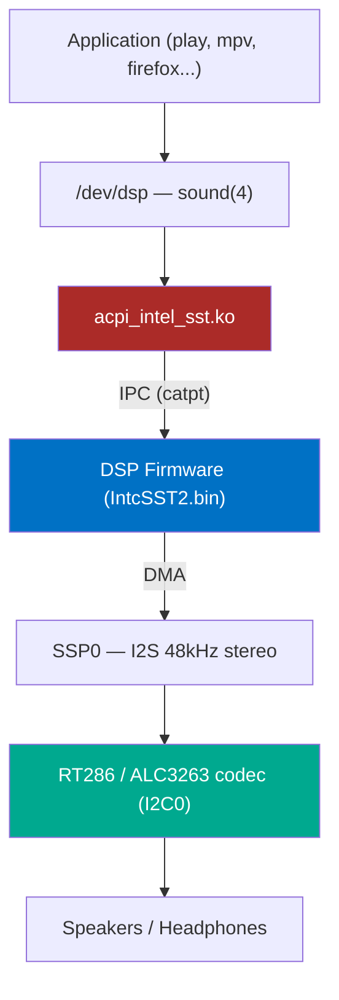

---

## BAR0 Memory Map

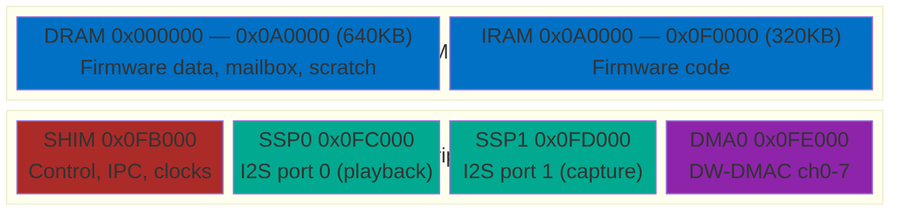

---

## Driver Initialization Sequence

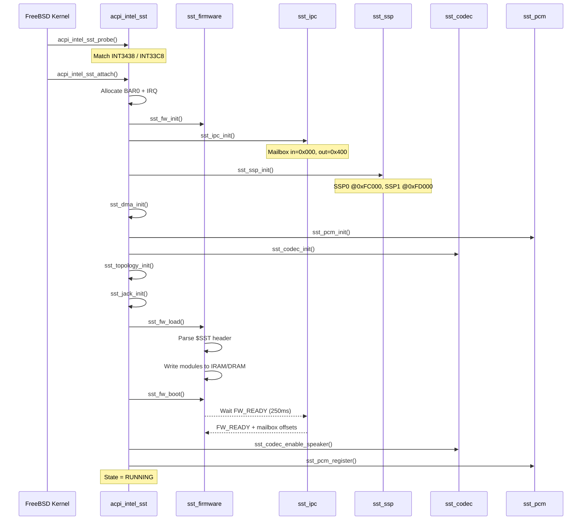

---

## DSP Firmware Boot

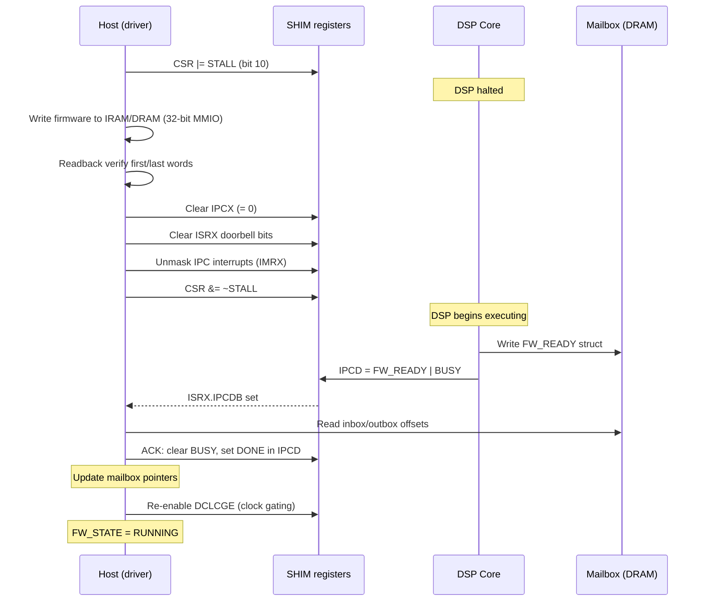

---

## IPC Message Exchange

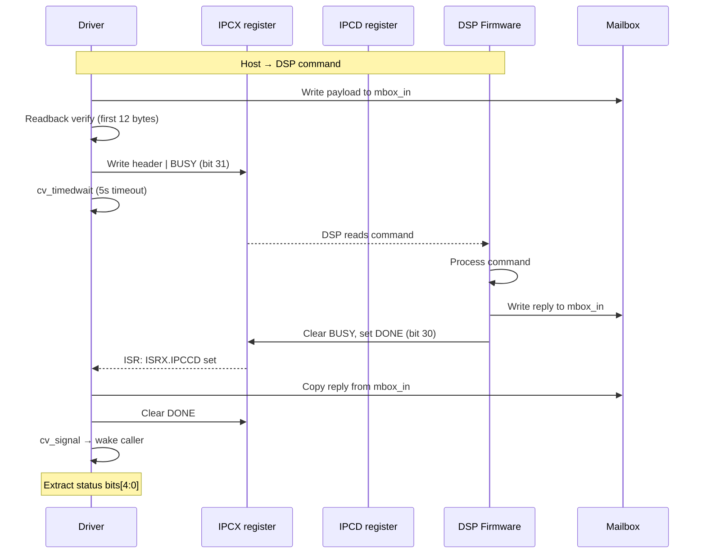

---

## PCM Playback Flow

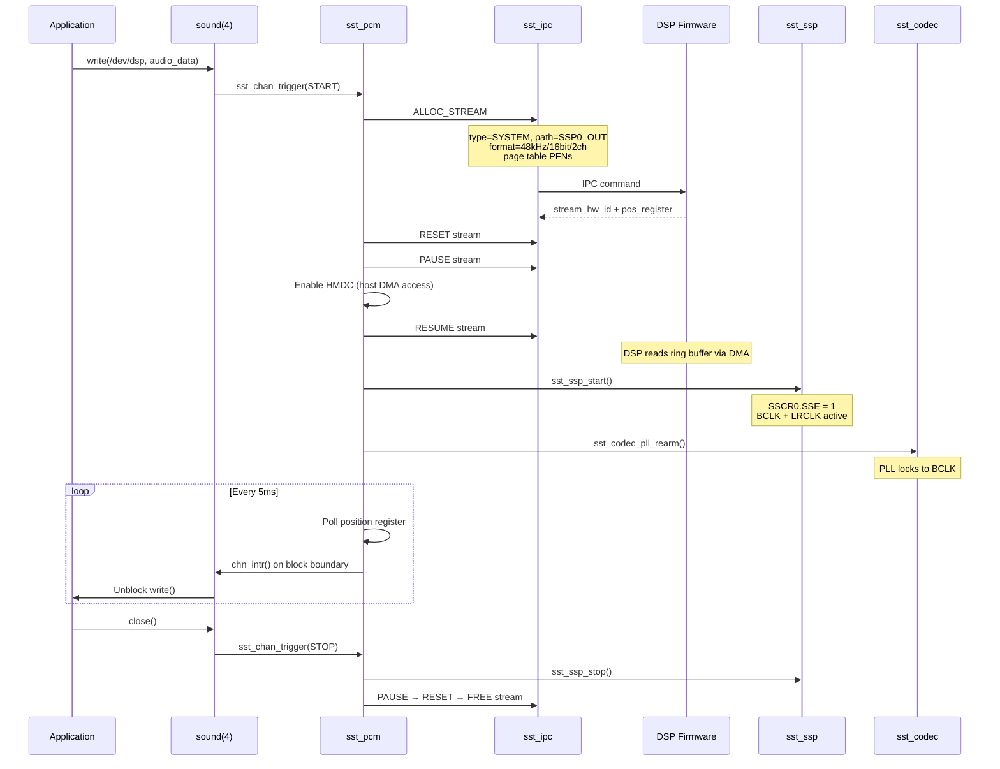

---

## RT286 Codec Initialization

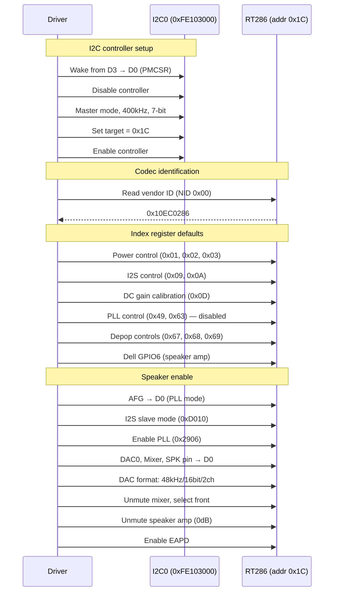

---

## SSP/I2S Configuration

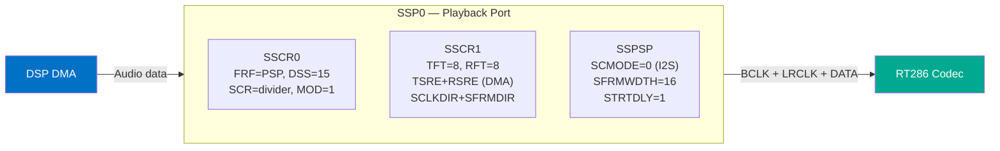

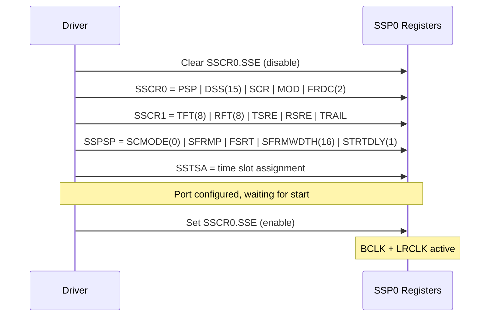

---

## DMA & Page Table

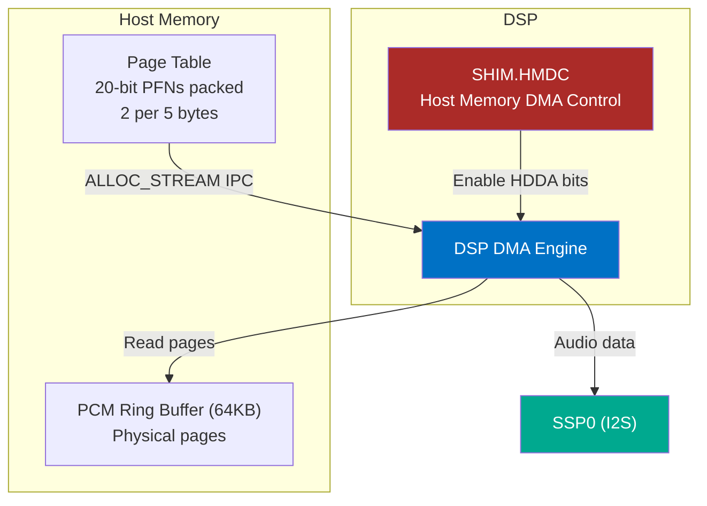

---

## Module Detach / Cleanup

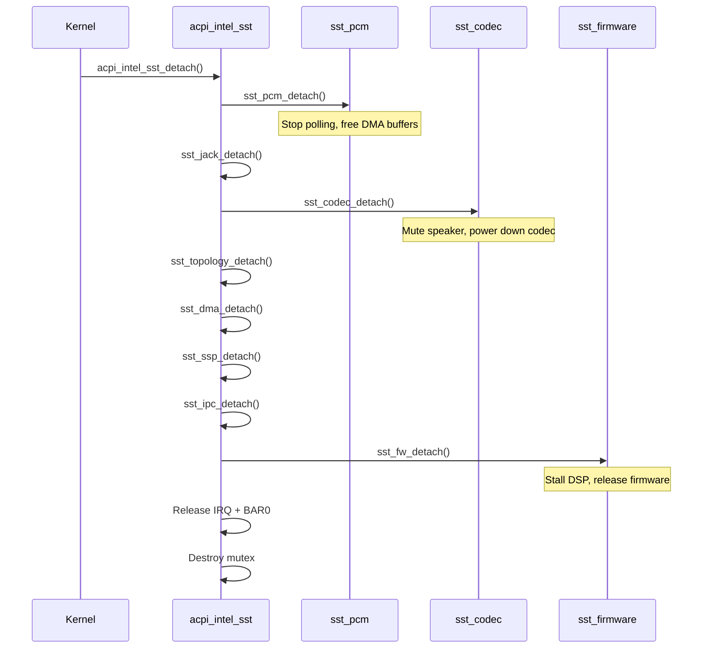

---

## Jack Detection

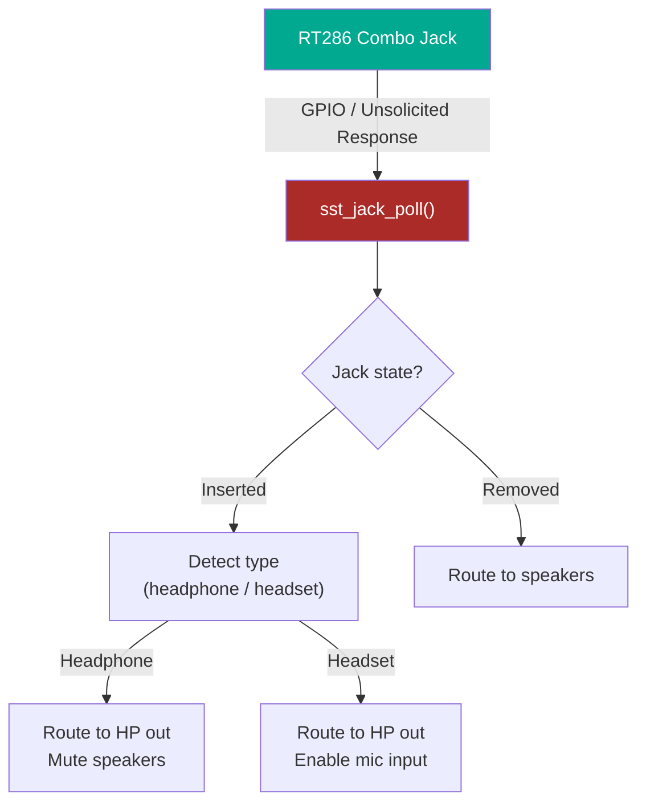
