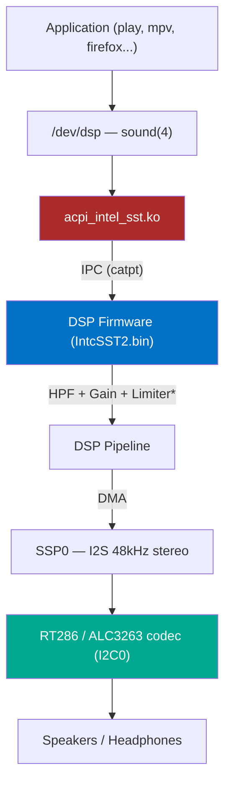

<div align="center">


# Intel SST Audio Driver for FreeBSD

**The first Intel Smart Sound Technology driver for any BSD operating system**

[](https://www.freebsd.org/)
[](LICENSE)
[](https://ark.intel.com/)
[](#current-status-v0560)

[](https://github.com/spagu/acpi_intel_sst)
[](#2-install-firmware)
[](https://www.realtek.com/)
[](https://github.com/torvalds/linux/tree/master/sound/soc/intel/catpt)

*Native analog audio on Dell XPS 13 9343 and other Broadwell-U platforms*
*with Realtek RT286/ALC3263 codec over I2S/SSP*

</div>

---

## Overview

On Intel Broadwell-U laptops like the Dell XPS 13 9343, analog audio (speakers and headphones) is routed through the Intel SST DSP, not standard HDA. FreeBSD's built-in `hdac` driver only handles HDMI/DP audio on these machines. This kernel module provides the missing piece - a complete DSP firmware loader, IPC framework, and codec driver that brings analog audio to life.



> See [`DIAGRAMS.md`](DIAGRAMS.md) for detailed architecture and process flow diagrams.

---

## Quick Start

```bash
# Build
git clone https://github.com/spagu/acpi_intel_sst.git && cd acpi_intel_sst && make

# Install firmware
sudo mkdir -p /boot/firmware/intel
fetch -o /tmp/fw.deb 'http://ftp.debian.org/debian/pool/non-free-firmware/f/firmware-nonfree/firmware-intel-sound_20230210-5_all.deb'
cd /tmp && ar x fw.deb && tar xf data.tar.xz
sudo cp lib/firmware/intel/IntcSST2.bin /boot/firmware/intel/

# Load and play
sudo kldload ./acpi_intel_sst.ko
mixer vol 80 && play -n synth 3 sine 440
```

> **Note:** Dell XPS 13 9343 requires a [DSDT patch](#3-dsdt-patch-dell-xps-13-9343) and
> [loader.conf changes](#4-configure-bootloaderconf) before the driver will attach.
> See full [Installation](#installation) below.

---

## Current Status (v0.56.0)

<table>
<tr><td>

| Component | Status |
|:----------|:------:|
| ACPI/PCI probe & attach | :white_check_mark: |
| Power management (WPT) | :white_check_mark: |
| DSP firmware boot | :white_check_mark: |
| IPC framework (catpt) | :white_check_mark: |
| RT286 codec I2C | :white_check_mark: |
| SSP/I2S audio output | :white_check_mark: |
| PCM sound(4) | :white_check_mark: |
| Jack detection | :white_check_mark: |
| **Audio playback** | **:white_check_mark:** |

</td><td>

| Component | Status |
|:----------|:------:|
| Volume control (dB→Q1.31) | :white_check_mark: |
| Volume IPC rate-limiting | :white_check_mark: |
| HPF biquad (speaker protection) | :white_check_mark: |
| Peak limiter (speaker protection) | :white_check_mark: |
| DSP stage capability detection | :white_check_mark: |
| Dynamic pipeline topology | :white_check_mark: |
| DSP stream stall recovery | :white_check_mark: |
| Audio capture | :construction: |
| Suspend/resume | :construction: |

</td></tr>
</table>

> :white_check_mark: = Working&emsp; :construction: = Not yet implemented

---

## Installation

### Prerequisites

- FreeBSD 15-CURRENT (or 14.x with source tree at `/usr/src`)
- Intel Broadwell-U or Haswell platform
- Intel SST firmware (`IntcSST2.bin`)

### 1. Build

```bash
git clone https://github.com/spagu/acpi_intel_sst.git
cd acpi_intel_sst
make
```

### 2. Install Firmware

```bash
sudo mkdir -p /boot/firmware/intel
fetch -o /tmp/fw.deb \
  'http://ftp.debian.org/debian/pool/non-free-firmware/f/firmware-nonfree/firmware-intel-sound_20230210-5_all.deb'
cd /tmp && ar x fw.deb && tar xf data.tar.xz
sudo cp lib/firmware/intel/IntcSST2.bin /boot/firmware/intel/
```

<details>
<summary><b>Alternative firmware sources</b></summary>

**From a Linux system:**
```bash
apt download firmware-intel-sound
dpkg -x firmware-intel-sound*.deb /tmp/fw
cp /tmp/fw/lib/firmware/intel/IntcSST2.bin /path/to/freebsd/boot/firmware/intel/
```

**From Windows driver:**
Extract `IntcSST2.bin` from the Intel Smart Sound Technology driver package.

| Firmware file | Platform | Compatible |
|:---|:---|:---:|
| `IntcSST2.bin` | Broadwell-U / Haswell | :white_check_mark: |
| `fw_sst_0f28.bin` | Baytrail (Atom) | :x: |
| `fw_sst_22a8.bin` | Cherrytrail | :x: |

</details>

### 3. DSDT Patch (Dell XPS 13 9343)

The Dell BIOS disables the ADSP device unless Connected Standby is active.
A DSDT patch forces it on. See [acpi/README.md](acpi/README.md) for full instructions.

```bash
cd acpi_intel_sst/acpi
iasl DSDT_patched.dsl
sudo cp DSDT_patched.aml /boot/acpi_dsdt.aml
```

### 4. Configure /boot/loader.conf

Add the following to `/boot/loader.conf`:

```bash
# Custom DSDT with ADSP enabled
acpi_dsdt_load="YES"
acpi_dsdt_name="/boot/acpi_dsdt.aml"

# Required: DSDT needs OSYS >= 0x07DC to initialize LPSS fabric
hw.acpi.install_interface="Windows 2012"

# Disable GPU HDMI audio controller (conflicts with SST IRQ)
hint.hdac.0.disabled="1"

# Load SST driver at boot
acpi_intel_sst_load="YES"

# Disable ig4 I2C driver (SST driver accesses I2C0 directly for codec control)
ig4_load="NO"
hint.ig4.0.disabled="1"
hint.ig4.1.disabled="1"
```

<details>
<summary><b>Why each line is needed</b></summary>

| Setting | Reason |
|:--------|:-------|
| `acpi_dsdt_*` | Custom DSDT forces ADSP device enabled |
| `hw.acpi.install_interface` | DSDT requires OSYS >= 0x07DC to route memory to BAR0 |
| `hint.hdac.0.disabled` | Disables Intel GPU audio (hdac0 at pci0:0:3:0, 8086:160c) |
| `acpi_intel_sst_load` | Auto-load SST driver at boot |
| `ig4_load` / `hint.ig4.*` | Prevents ig4 driver from claiming I2C0, which SST uses directly for RT286 codec |

`hdac1` (PCH HDA at pci0:0:27:0, 8086:9ca0) does **not** need to be disabled -
it has no codecs on the HDA link (RT286 is on I2S), so it's harmless.

</details>

### 5. Cold Reboot and Test

> **Important:** A **cold boot** (full power off) is required for DSDT changes to take effect.

```bash
sudo shutdown -p now
# Wait 10 seconds, power on

# After boot:
cat /dev/sndstat
mixer vol 80
play -n synth 3 sine 440  # requires audio/sox
```

---

## Hardware

| Component | Details |
|:----------|:--------|
| **Platform** | Intel Broadwell-U (5th Gen Core) |
| **Tested Device** | Dell XPS 13 9343 (2015) |
| **DSP** | Intel SST (PCI 8086:9CB6 / ACPI INT3438) |
| **Codec** | Realtek RT286 / ALC3263 on I2C0, address 0x1C |
| **Transport** | I2S via SSP0 (playback) / SSP1 (capture, future) |
| **PCH** | Intel Wildcat Point-LP (WPT) |

### Supported IDs

| ID | Platform | Status |
|:---|:---------|:------:|
| `INT3438` (ACPI) | Intel Broadwell-U | :white_check_mark: Tested |
| `INT33C8` (ACPI) | Intel Haswell | :grey_question: Untested |
| `8086:9CB6` (PCI) | Intel Broadwell-U | :white_check_mark: Tested |
| `8086:9C76` (PCI) | Intel Haswell | :grey_question: Untested |

### Other Broadwell-U Devices

These devices use the same Intel SST DSP and may work (untested):

| Manufacturer | Models |
|:-------------|:-------|
| **Dell** | XPS 13 9343 (**confirmed**) |
| **HP** | Spectre x360, EliteBook 720/750/850 G2, Folio 1040 G2 |
| **Lenovo** | ThinkPad X250, X1 Carbon Gen 3, Yoga 3 14 |
| **Asus** | Zenbook UX303LA/LB, UX305LA |
| **Acer** | Aspire R13, Aspire S7-393 |

> If you have one of these running FreeBSD, please test and [report results](https://github.com/spagu/acpi_intel_sst/issues)!

---

## Source Files

| File | Purpose |
|:-----|:--------|
| [`acpi_intel_sst.c`](acpi_intel_sst.c) | Main driver: ACPI/PCI probe, attach, power, ISR |
| [`sst_firmware.c`](sst_firmware.c) | Firmware load, parse ($SST format), DSP boot |
| [`sst_ipc.c`](sst_ipc.c) | Host-DSP IPC messaging (catpt protocol) |
| [`sst_codec.c`](sst_codec.c) | RT286 codec control over I2C (DesignWare I2C0 at 0xFE103000) |
| [`sst_pcm.c`](sst_pcm.c) | sound(4) PCM integration, DMA page tables, DSP stream alloc |
| [`sst_ssp.c`](sst_ssp.c) | I2S/SSP port configuration (2 ports) |
| [`sst_dma.c`](sst_dma.c) | DMA controller (DesignWare DW-DMAC, 8 channels) |
| [`sst_jack.c`](sst_jack.c) | Headphone jack detection (GPIO polling, debounce) |
| [`sst_topology.c`](sst_topology.c) | Audio pipeline configuration (dynamic topology with HPF biquad, limiter) |
| [`sst_regs.h`](sst_regs.h) | Hardware register definitions (SHIM, VDRTCTL, SSP, DMA) |

---

## Known Issues

| Issue | Details |
|:------|:--------|
| **Capture disabled** | Channels registered but skipped; DSP can't do simultaneous play+capture on same SSP |
| **No suspend/resume** | Driver doesn't handle D3 transitions during sleep |
| **Single platform tested** | Only Dell XPS 13 9343; other Broadwell-U/Haswell untested |

---

## Documentation

| | File | Description |
|:--|:-----|:------------|
| :book: | [STATUS.md](STATUS.md) | Current driver status, known issues, next steps |
| :scroll: | [CHANGELOG.md](CHANGELOG.md) | Detailed version history (v0.1.0 - v0.56.0) |
| :handshake: | [CONTRIBUTING.md](CONTRIBUTING.md) | How to contribute |
| :wrench: | [acpi/README.md](acpi/README.md) | DSDT patch instructions for Dell XPS 13 9343 |
| :bar_chart: | [DIAGRAMS.md](DIAGRAMS.md) | Architecture & process flow diagrams (Mermaid) |
| :microscope: | [docs/RESEARCH_FINDINGS.md](docs/RESEARCH_FINDINGS.md) | BAR0 investigation, SRAM power gating, IOBP sideband, catpt reference |

---

## References

- [Linux catpt driver](https://github.com/torvalds/linux/tree/master/sound/soc/intel/catpt) - reference implementation
- [CoolStar Windows SST driver](https://github.com/coolstar/csaudiosstcatpt)
- [Debian firmware-intel-sound](https://packages.debian.org/bookworm/firmware-intel-sound)
- [ArchWiki: Dell XPS 13 (9343)](https://wiki.archlinux.org/title/Dell_XPS_13_(9343))
- [coreboot Broadwell ADSP init](https://github.com/coreboot/coreboot/blob/master/src/soc/intel/broadwell/pch/adsp.c)

---

<div align="center">

**BSD-3-Clause** &bull; See [LICENSE](LICENSE) for details

Contributions welcome! See [CONTRIBUTING.md](CONTRIBUTING.md)

[Report Bug](https://github.com/spagu/acpi_intel_sst/issues) &bull; [Request Feature](https://github.com/spagu/acpi_intel_sst/issues)

</div>
