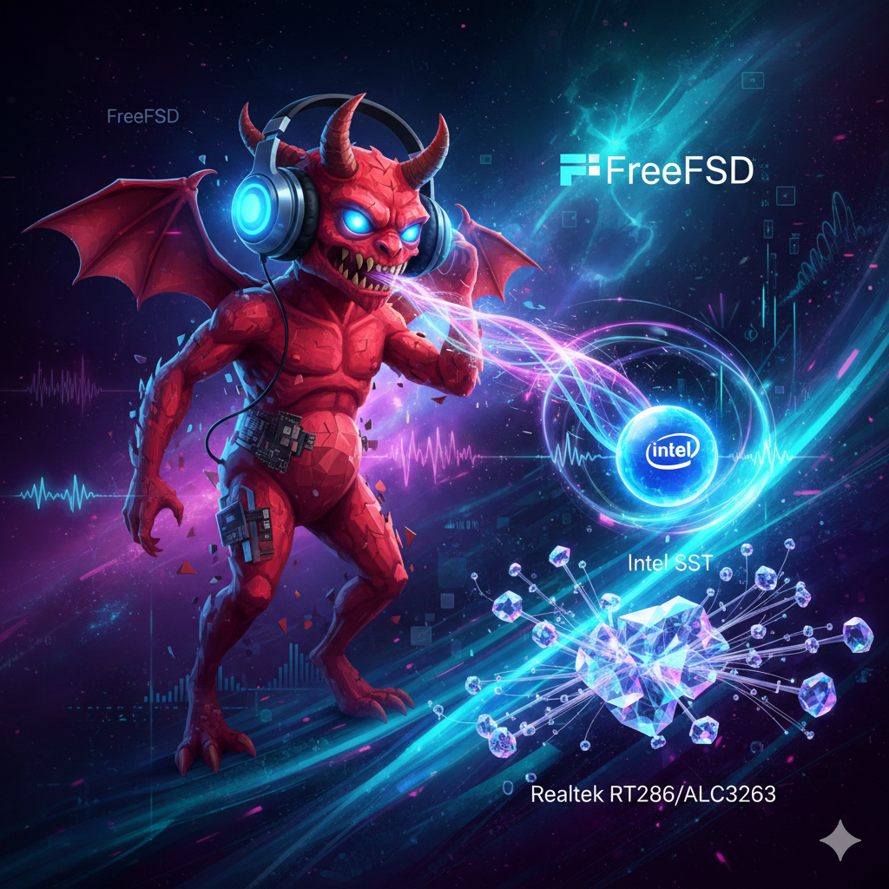
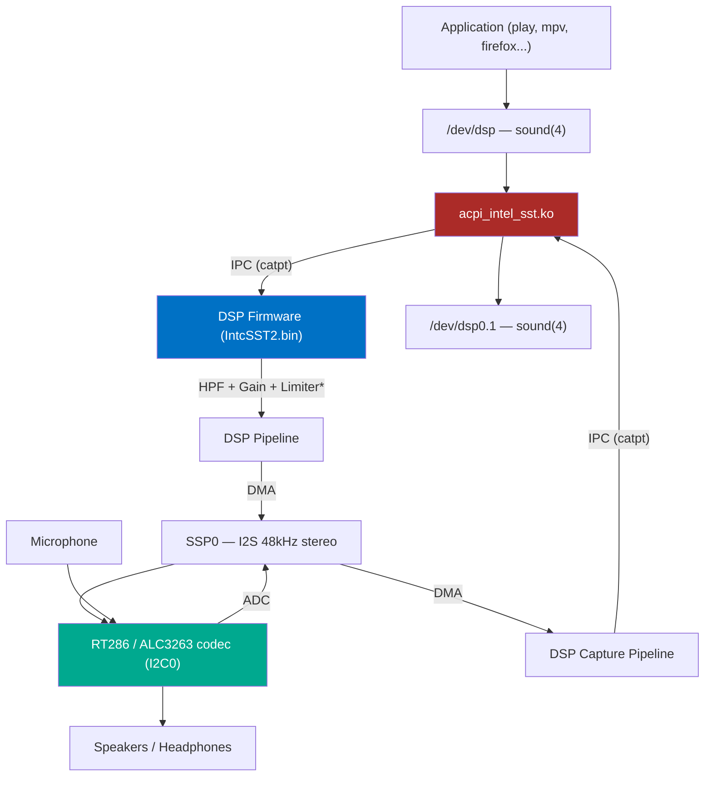

<div align="center">



# Intel SST Audio Driver for FreeBSD

**The first Intel Smart Sound Technology driver for any BSD operating system**

[](https://www.freebsd.org/)
[](LICENSE)
[](https://ark.intel.com/)
[](#current-status-v0640)

[](https://github.com/spagu/acpi_intel_sst)
[](#2-install-firmware)
[](https://www.realtek.com/)
[](https://github.com/torvalds/linux/tree/master/sound/soc/intel/catpt)

*Native analog audio (playback + capture) on Dell XPS 13 9343 and other*
*Broadwell-U platforms with Realtek RT286/ALC3263 codec over I2S/SSP*

</div>

---

## Overview

On Intel Broadwell-U laptops like the Dell XPS 13 9343, analog audio (speakers, headphones, and microphone) is routed through the Intel SST DSP, not standard HDA. FreeBSD's built-in `hdac` driver only handles HDMI/DP audio on these machines. This kernel module provides the missing piece - a complete DSP firmware loader, IPC framework, and codec driver that brings analog audio playback and capture to life.



> See [`DIAGRAMS.md`](DIAGRAMS.md) for detailed architecture and process flow diagrams.

---

## Quick Start

```bash
# Build
git clone https://github.com/spagu/acpi_intel_sst.git && cd acpi_intel_sst && make

# Install firmware
sudo mkdir -p /boot/firmware/intel
fetch -o /tmp/fw.deb 'http://ftp.debian.org/debian/pool/non-free-firmware/f/firmware-nonfree/firmware-intel-sound_20230210-5_all.deb'
cd /tmp && ar x fw.deb && tar xf data.tar.xz
sudo cp lib/firmware/intel/IntcSST2.bin /boot/firmware/intel/

# Load and play
sudo kldload ./acpi_intel_sst.ko
mixer vol 80 && play -n synth 3 sine 440

# Record 5 seconds from microphone
cat /dev/dsp0.1 > /tmp/test.raw &
sleep 5 && kill %1
```

> **Note:** Dell XPS 13 9343 requires a [DSDT patch](#3-dsdt-patch-dell-xps-13-9343) and
> [loader.conf changes](#4-configure-bootloaderconf) before the driver will attach.
> See full [Installation](#installation) below.

---

## Current Status (v0.64.0)

<table>
<tr><td>

| Component | Status |
|:----------|:------:|
| ACPI/PCI probe & attach | :white_check_mark: |
| Power management (WPT) | :white_check_mark: |
| DSP firmware boot | :white_check_mark: |
| IPC framework (catpt) | :white_check_mark: |
| RT286 codec I2C | :white_check_mark: |
| SSP/I2S audio output | :white_check_mark: |
| PCM sound(4) | :white_check_mark: |
| Jack detection | :white_check_mark: |
| **Audio playback** | **:white_check_mark:** |
| **Audio capture** | **:white_check_mark:** |
| **Full-duplex (play+rec)** | **:white_check_mark:** |

</td><td>

| Component | Status |
|:----------|:------:|
| Volume control (dB→Q1.31) | :white_check_mark: |
| Volume IPC rate-limiting | :white_check_mark: |
| EQ presets (speaker protection) | :white_check_mark: |
| Peak limiter (speaker protection) | :white_check_mark: |
| DSP stage capability detection | :white_check_mark: |
| Gain staging / headroom (-3dBFS) | :white_check_mark: |
| Dynamic pipeline topology | :white_check_mark: |
| DSP stream stall recovery | :white_check_mark: |
| Suspend/resume (S3) | :white_check_mark: |
| Resume volume ramp (anti-pop) | :white_check_mark: |
| Debug verbosity sysctl (0-3) | :white_check_mark: |
| DSP peak meter telemetry | :white_check_mark: |
| Clipping detection | :white_check_mark: |
| Capture mixer (mic volume) | :white_check_mark: |

</td></tr>
</table>

> :white_check_mark: = Working

---

## Installation

### Prerequisites

- FreeBSD 15-CURRENT (or 14.x with source tree at `/usr/src`)
- Intel Broadwell-U or Haswell platform
- Intel SST firmware (`IntcSST2.bin`)

### 1. Build

```bash
git clone https://github.com/spagu/acpi_intel_sst.git
cd acpi_intel_sst
make
```

### 2. Install Firmware

```bash
sudo mkdir -p /boot/firmware/intel
fetch -o /tmp/fw.deb \
  'http://ftp.debian.org/debian/pool/non-free-firmware/f/firmware-nonfree/firmware-intel-sound_20230210-5_all.deb'
cd /tmp && ar x fw.deb && tar xf data.tar.xz
sudo cp lib/firmware/intel/IntcSST2.bin /boot/firmware/intel/
```

<details>
<summary><b>Alternative firmware sources</b></summary>

**From a Linux system:**
```bash
apt download firmware-intel-sound
dpkg -x firmware-intel-sound*.deb /tmp/fw
cp /tmp/fw/lib/firmware/intel/IntcSST2.bin /path/to/freebsd/boot/firmware/intel/
```

**From Windows driver:**
Extract `IntcSST2.bin` from the Intel Smart Sound Technology driver package.

| Firmware file | Platform | Compatible |
|:---|:---|:---:|
| `IntcSST2.bin` | Broadwell-U / Haswell | :white_check_mark: |
| `fw_sst_0f28.bin` | Baytrail (Atom) | :x: |
| `fw_sst_22a8.bin` | Cherrytrail | :x: |

</details>

### 3. DSDT Patch (Dell XPS 13 9343)

The Dell BIOS disables the ADSP device unless Connected Standby is active.
A DSDT patch forces it on. See [acpi/README.md](acpi/README.md) for full instructions.

```bash
cd acpi_intel_sst/acpi
iasl DSDT_patched.dsl
sudo cp DSDT_patched.aml /boot/acpi_dsdt.aml
```

### 4. Configure /boot/loader.conf

Add the following to `/boot/loader.conf`:

```bash
# Custom DSDT with ADSP enabled
acpi_dsdt_load="YES"
acpi_dsdt_name="/boot/acpi_dsdt.aml"

# Required: DSDT needs OSYS >= 0x07DC to initialize LPSS fabric
hw.acpi.install_interface="Windows 2012"

# Disable GPU HDMI audio controller (conflicts with SST IRQ)
hint.hdac.0.disabled="1"

# Load SST driver at boot
acpi_intel_sst_load="YES"

# Disable ig4 I2C driver (SST driver accesses I2C0 directly for codec control)
ig4_load="NO"
hint.ig4.0.disabled="1"
hint.ig4.1.disabled="1"
```

<details>
<summary><b>Why each line is needed</b></summary>

| Setting | Reason |
|:--------|:-------|
| `acpi_dsdt_*` | Custom DSDT forces ADSP device enabled |
| `hw.acpi.install_interface` | DSDT requires OSYS >= 0x07DC to route memory to BAR0 |
| `hint.hdac.0.disabled` | Disables Intel GPU audio (hdac0 at pci0:0:3:0, 8086:160c) |
| `acpi_intel_sst_load` | Auto-load SST driver at boot |
| `ig4_load` / `hint.ig4.*` | Prevents ig4 driver from claiming I2C0, which SST uses directly for RT286 codec |

`hdac1` (PCH HDA at pci0:0:27:0, 8086:9ca0) does **not** need to be disabled -
it has no codecs on the HDA link (RT286 is on I2S), so it's harmless.

</details>

### 5. Cold Reboot and Test

> **Important:** A **cold boot** (full power off) is required for DSDT changes to take effect.

```bash
sudo shutdown -p now
# Wait 10 seconds, power on

# After boot:
cat /dev/sndstat
mixer vol 80
play -n synth 3 sine 440  # requires audio/sox

# Test capture (microphone):
mixer mic 80
cat /dev/dsp0.1 > /tmp/test.raw &
sleep 5 && kill %1
```

---

## Sysctl Configuration Reference

All runtime parameters are exposed via `sysctl` under `dev.acpi_intel_sst.0.*`.
DSP parameters take effect immediately on active streams without pipeline restart.
State is persisted across suspend/resume cycles.

### Debug

| Sysctl | RW | Range | Default | Description |
|:-------|:--:|:------|:--------|:------------|
| `debug` | RW | 0-3 | 1 | Debug verbosity: 0=quiet (errors only), 1=lifecycle (attach, fw load, stream alloc), 2=operational (IPC, volume, EQ), 3=trace (polls, register dumps). |

> Boot-time override: add `hint.acpi_intel_sst.0.debug="3"` to `/boot/device.hints`.

### DSP Telemetry

| Sysctl | RW | Type | Description |
|:-------|:--:|:-----|:------------|
| `telemetry.peak_left` | RO | uint | Raw Q1.31 peak level, left channel |
| `telemetry.peak_right` | RO | uint | Raw Q1.31 peak level, right channel |
| `telemetry.peak_db_left` | RO | string | Peak level in dB (e.g. "-3.2 dB") |
| `telemetry.peak_db_right` | RO | string | Peak level in dB (e.g. "-3.2 dB") |
| `telemetry.clip_count` | RO | uint | Cumulative clipping events |
| `telemetry.clip_reset` | WO | int | Write 1 to clear clip counter |
| `telemetry.limiter_active` | RO | int | DSP limiter currently engaging (0/1) |

### DSP Audio Parameters

| Sysctl | RW | Range | Default | Description |
|:-------|:--:|:------|:--------|:------------|
| `eq_preset` | RW | 0-2 | 1 | EQ preset shortcut (0=flat, 1=stock\_speaker 150Hz, 2=mod\_speaker 100Hz). Sets `hpf_cutoff` and reverts to HPF mode. |
| `hpf_cutoff` | RW | 0, 50-500 | 150 | HPF cutoff frequency in Hz. 0=flat bypass. Snaps to nearest table entry. Writing overrides `eq_preset`. |
| `limiter_threshold` | RW | 0-8 | 5 | Limiter threshold preset index (0=bypass, 1=-24dBFS, 5=-6dBFS, 8=0dBFS). |
| `limiter_release` | RW | 0, 10000-500000 | 0 | Limiter release time override in microseconds. 0=use preset default. |
| `peq_freq` | RW | 0, 200-16000 | 0 | PEQ center frequency in Hz. 0=off (HPF mode). Setting >0 activates PEQ mode. |
| `peq_gain` | RW | -12 to +12 | 0 | PEQ boost/cut in dB. Positive values reduce volume ceiling (gain budget). |
| `peq_q` | RW | 30-1000 | 71 | PEQ Q factor x100 (e.g. 71=0.71, 141=1.41, 1000=10.0). |

### Volume Ramp-In

| Sysctl | RW | Range | Default | Description |
|:-------|:--:|:------|:--------|:------------|
| `ramp_ms` | RW | 0-500 | 50 | Volume ramp-in on playback start in ms. 0=off (immediate volume). |
| `resume_ramp_ms` | RW | 0-500 | 50 | Volume ramp-in after S3 resume in ms. Always on by default, independent of `ramp_ms`. |
| `ramp_curve` | RW | 0-2 | 0 | Ramp curve: 0=logarithmic (perceptual), 1=linear, 2=s-curve (ease-in-out). |

**Biquad mode:** HPF and PEQ share the single biquad stage (mutually exclusive).
Setting `peq_freq > 0` activates PEQ mode; setting it to 0 reverts to HPF mode
using the current `hpf_cutoff`.

**Gain budget:** When PEQ has positive `peq_gain`, the volume ceiling is
automatically reduced by that amount to prevent clipping. The 3dB headroom
policy (from `SST_HEADROOM_DB`) is enforced on top.

**Limiter presets:**

| Index | Threshold | Attack | Default Release |
|:-----:|:---------:|:------:|:---------------:|
| 0 | bypass | - | - |
| 1 | -24 dBFS | 1ms | 50ms |
| 2 | -18 dBFS | 1ms | 75ms |
| 3 | -12 dBFS | 1ms | 100ms |
| 4 | -9 dBFS | 1ms | 115ms |
| 5 | -6 dBFS | 1ms | 135ms |
| 6 | -3 dBFS | 1ms | 160ms |
| 7 | -1 dBFS | 1ms | 180ms |
| 8 | 0 dBFS | 1ms | 200ms |

### Jack Detection

| Sysctl | RW | Description |
|:-------|:--:|:------------|
| `jack.headphone` | RO | Headphone jack state (0=removed, 1=inserted) |
| `jack.microphone` | RO | Microphone jack state (0=removed, 1=inserted) |
| `jack.enabled` | RW | Enable/disable jack detection polling |
| `jack.hp_insertions` | RO | Headphone insertion count (lifetime) |
| `jack.mic_insertions` | RO | Microphone insertion count (lifetime) |
| `jack.poll_count` | RO | Jack polling cycle count |

### Examples

```sh
# Show all driver parameters
sysctl dev.acpi_intel_sst.0

# --- HPF cutoff control ---
sysctl dev.acpi_intel_sst.0.hpf_cutoff=100    # 100Hz high-pass
sysctl dev.acpi_intel_sst.0.hpf_cutoff=0       # bypass (flat)

# --- EQ presets (convenience shortcut) ---
sysctl dev.acpi_intel_sst.0.eq_preset=1        # stock speaker (HPF 150Hz)
sysctl dev.acpi_intel_sst.0.eq_preset=0        # flat bypass

# --- Limiter ---
sysctl dev.acpi_intel_sst.0.limiter_threshold=3     # -12dBFS
sysctl dev.acpi_intel_sst.0.limiter_release=100000   # 100ms release override
sysctl dev.acpi_intel_sst.0.limiter_release=0        # revert to preset default

# --- Parametric EQ: +3dB peak at 1kHz, Q=1.41 ---
sysctl dev.acpi_intel_sst.0.peq_freq=1000
sysctl dev.acpi_intel_sst.0.peq_gain=3
sysctl dev.acpi_intel_sst.0.peq_q=141

# --- PEQ boost engages gain budget ---
sysctl dev.acpi_intel_sst.0.peq_gain=12   # max boost, volume ceiling drops
sysctl dev.acpi_intel_sst.0.peq_freq=0     # disable PEQ, revert to HPF

# --- Debug verbosity ---
sysctl dev.acpi_intel_sst.0.debug=0           # quiet (errors only)
sysctl dev.acpi_intel_sst.0.debug=3           # full trace

# --- Telemetry ---
sysctl dev.acpi_intel_sst.0.telemetry.peak_db_left   # current peak level
sysctl dev.acpi_intel_sst.0.telemetry.clip_count      # clipping events
sysctl dev.acpi_intel_sst.0.telemetry.clip_reset=1    # reset clip counter
sysctl dev.acpi_intel_sst.0.telemetry.limiter_active  # limiter engaging?

# --- Volume ramp-in ---
sysctl dev.acpi_intel_sst.0.ramp_ms=100        # 100ms fade-in on playback start
sysctl dev.acpi_intel_sst.0.ramp_ms=0           # disable (immediate volume)
sysctl dev.acpi_intel_sst.0.resume_ramp_ms=80   # 80ms fade-in after S3 resume
sysctl dev.acpi_intel_sst.0.ramp_curve=0        # logarithmic (default)
sysctl dev.acpi_intel_sst.0.ramp_curve=1        # linear
sysctl dev.acpi_intel_sst.0.ramp_curve=2        # s-curve

# --- Jack detection ---
sysctl dev.acpi_intel_sst.0.jack.headphone    # check headphone state
sysctl dev.acpi_intel_sst.0.jack.enabled=0    # disable jack polling
```

---

## Hardware

| Component | Details |
|:----------|:--------|
| **Platform** | Intel Broadwell-U (5th Gen Core) |
| **Tested Device** | Dell XPS 13 9343 (2015) |
| **DSP** | Intel SST (PCI 8086:9CB6 / ACPI INT3438) |
| **Codec** | Realtek RT286 / ALC3263 on I2C0, address 0x1C |
| **Transport** | I2S via SSP0 (full-duplex: playback + capture, ref-counted) |
| **PCH** | Intel Wildcat Point-LP (WPT) |

### Supported IDs

| ID | Platform | Status |
|:---|:---------|:------:|
| `INT3438` (ACPI) | Intel Broadwell-U | :white_check_mark: Tested |
| `INT33C8` (ACPI) | Intel Haswell | :grey_question: Untested |
| `8086:9CB6` (PCI) | Intel Broadwell-U | :white_check_mark: Tested |
| `8086:9C76` (PCI) | Intel Haswell | :grey_question: Untested |

### Other Broadwell-U Devices

These devices use the same Intel SST DSP and may work (untested):

| Manufacturer | Models |
|:-------------|:-------|
| **Dell** | XPS 13 9343 (**confirmed**) |
| **HP** | Spectre x360, EliteBook 720/750/850 G2, Folio 1040 G2 |
| **Lenovo** | ThinkPad X250, X1 Carbon Gen 3, Yoga 3 14 |
| **Asus** | Zenbook UX303LA/LB, UX305LA |
| **Acer** | Aspire R13, Aspire S7-393 |

> If you have one of these running FreeBSD, please test and [report results](https://github.com/spagu/acpi_intel_sst/issues)!

---

## Source Files

| File | Purpose |
|:-----|:--------|
| [`acpi_intel_sst.c`](acpi_intel_sst.c) | Main driver: ACPI/PCI probe, attach, power, ISR |
| [`sst_power.c`](sst_power.c) | DSP power management (D0/D3, VDRTCTL, clock gating) |
| [`sst_pch.c`](sst_pch.c) | PCH/Wildcat Point configuration (IOBP sideband, ADSP enable) |
| [`sst_sram.c`](sst_sram.c) | SRAM power gating (IRAM/DRAM bank control) |
| [`sst_firmware.c`](sst_firmware.c) | Firmware load, parse ($SST format), DSP boot |
| [`sst_ipc.c`](sst_ipc.c) | Host-DSP IPC messaging (catpt protocol) |
| [`sst_codec.c`](sst_codec.c) | RT286 codec control over I2C (speaker, headphone, microphone) |
| [`sst_pcm.c`](sst_pcm.c) | sound(4) PCM integration, playback + capture, mixer |
| [`sst_ssp.c`](sst_ssp.c) | I2S/SSP port configuration (ref-counted for full-duplex) |
| [`sst_dma.c`](sst_dma.c) | DMA controller (DesignWare DW-DMAC, 8 channels) |
| [`sst_jack.c`](sst_jack.c) | Headphone/microphone jack detection (GPIO polling, debounce) |
| [`sst_topology.c`](sst_topology.c) | Audio pipeline configuration (playback + capture pipelines) |
| [`sst_regs.h`](sst_regs.h) | Hardware register definitions (SHIM, VDRTCTL, SSP, DMA) |

---

## Known Issues

| Issue | Details |
|:------|:--------|
| **Single platform tested** | Only Dell XPS 13 9343; other Broadwell-U/Haswell untested |

---

## Documentation

| | File | Description |
|:--|:-----|:------------|
| :book: | [STATUS.md](STATUS.md) | Current driver status, known issues, next steps |
| :scroll: | [CHANGELOG.md](CHANGELOG.md) | Detailed version history (v0.1.0 - v0.64.0) |
| :handshake: | [CONTRIBUTING.md](CONTRIBUTING.md) | How to contribute |
| :wrench: | [acpi/README.md](acpi/README.md) | DSDT patch instructions for Dell XPS 13 9343 |
| :bar_chart: | [DIAGRAMS.md](DIAGRAMS.md) | Architecture & process flow diagrams (Mermaid) |
| :microscope: | [docs/RESEARCH_FINDINGS.md](docs/RESEARCH_FINDINGS.md) | BAR0 investigation, SRAM power gating, IOBP sideband, catpt reference |

---

## References

- [Linux catpt driver](https://github.com/torvalds/linux/tree/master/sound/soc/intel/catpt) - reference implementation
- [CoolStar Windows SST driver](https://github.com/coolstar/csaudiosstcatpt)
- [Debian firmware-intel-sound](https://packages.debian.org/bookworm/firmware-intel-sound)
- [ArchWiki: Dell XPS 13 (9343)](https://wiki.archlinux.org/title/Dell_XPS_13_(9343))
- [coreboot Broadwell ADSP init](https://github.com/coreboot/coreboot/blob/master/src/soc/intel/broadwell/pch/adsp.c)

---

<div align="center">

**BSD-3-Clause** &bull; See [LICENSE](LICENSE) for details

Contributions welcome! See [CONTRIBUTING.md](CONTRIBUTING.md)

[Report Bug](https://github.com/spagu/acpi_intel_sst/issues) &bull; [Request Feature](https://github.com/spagu/acpi_intel_sst/issues)

</div>
