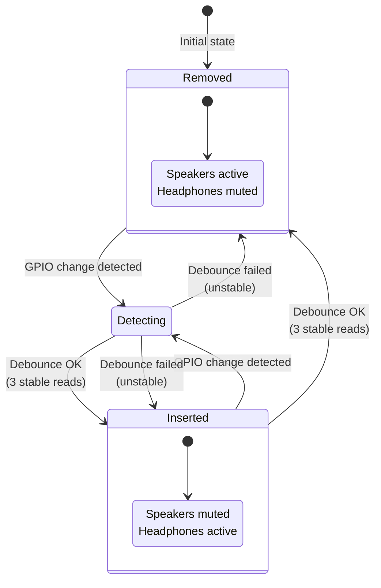
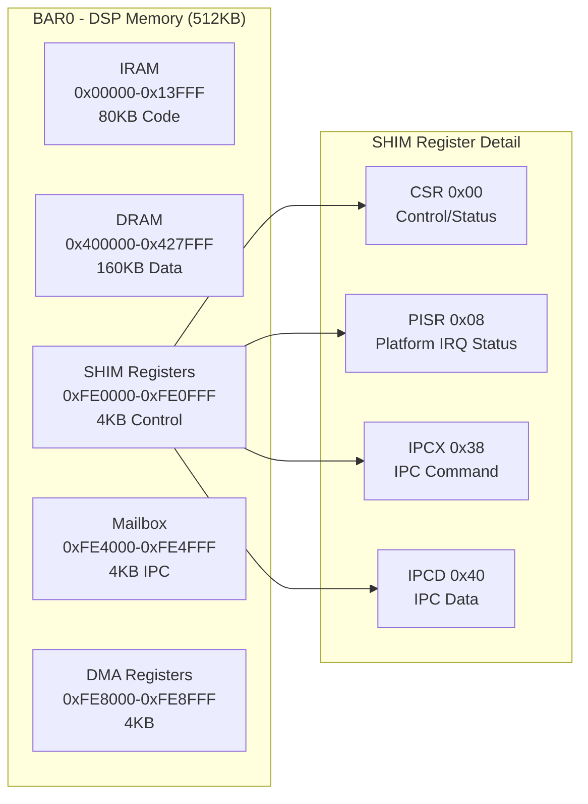

# 🔊 Intel SST Audio Driver for FreeBSD

[](https://github.com/spagu/acpi_intel_sst/actions/workflows/build.yml)
[](https://www.freebsd.org/)
[](LICENSE)
[](https://ark.intel.com/)
[](https://github.com/spagu/acpi_intel_sst)
[](CONTRIBUTING.md)

> **Experimental FreeBSD kernel module driver for Intel Smart Sound Technology (SST) DSP**
> Enabling analog audio on Broadwell-U platforms with Realtek ALC3263 codec

---

## 📋 Table of Contents

- [Overview](#-overview)
- [Hardware Support](#-hardware-support)
- [Architecture](#-architecture)
- [Current Status](#-current-status)
- [Requirements](#-requirements)
- [Firmware](#-firmware)
- [Installation](#-installation)
- [Usage](#-usage)
- [Debugging](#-debugging)
- [Project Roadmap](#-project-roadmap)
- [Technical Details](#-technical-details)
- [Implementation Plan](#-implementation-plan)
- [Contributing](#-contributing)
- [License](#-license)

---

## 🎯 Overview

This project provides an **ACPI kernel module driver** for the Intel Smart Sound Technology (SST) Digital Signal Processor found on Intel Broadwell-U platforms. The driver enables analog audio output on systems like the Dell XPS 13 9343, where audio is routed through the DSP via I2S (not traditional HDA).

### The Problem

On Broadwell-U platforms with Realtek ALC3263:
- ❌ Standard `snd_hda` driver only provides HDMI/DP audio
- ❌ Analog audio (speakers/headphones) requires DSP initialization
- ❌ FreeBSD has no SST driver - audio DSP shows as "unknown device"

### The Solution

This driver:
- ✅ Attaches to ACPI device `INT3438` / `INT33C8`
- ✅ Initializes DSP hardware (memory mapping, power management)
- ✅ Prepares foundation for firmware loading and audio playback

---

## 💻 Hardware Support

| Component | Details |
|-----------|---------|
| **Platform** | Intel Broadwell-U (5th Gen Core) |
| **Tested Device** | Dell XPS 13 9343 (2015) |
| **PCI Controller** | Intel Broadwell-U Audio (8086:160c) |
| **ACPI DSP** | INT3438 (`_SB.PCI0.ADSP`) |
| **Codec** | Realtek ALC3263 (VEN_10EC DEV_0282) |
| **Transport** | I2S via DSP (not HDA) |

### Supported ACPI IDs

| ID | Platform |
|----|----------|
| `INT3438` | Intel Broadwell-U |
| `INT33C8` | Intel Haswell |

### Compatible Devices (Realtek ALC3263)

The following devices use the Realtek ALC3263 codec and may benefit from this driver:

| Device | Year | Notes |
|--------|------|-------|
| **Dell XPS 13 9343** | 2015 | ✅ Primary development target |
| Dell XPS 12 9250 | 2016 | Hybrid tablet/laptop |
| Dell XPS 13 9310 | 2020 | 11th Gen Intel |
| Dell XPS 13 9350 | 2015 | Skylake platform |
| Dell XPS 13 9370 | 2018 | 8th Gen Intel |
| Dell XPS 17 9700 | 2020 | 10th Gen Intel |
| Dell XPS 17 9720 | 2022 | 12th Gen Intel |
| Dell XPS 17 9730 | 2023 | 13th Gen Intel |
| Dell Vostro 7590 | 2019 | 9th Gen Intel |

> ⚠️ **Note:** Some models use ALC3263 as USB audio codec (e.g., for docking stations) rather than internal laptop audio. Compatibility may vary depending on the specific audio routing in each model. The driver is primarily designed for I2S/DSP-based implementations found in Broadwell-U platforms.

### Other Broadwell-U Devices (INT3438 SST)

These Intel Broadwell-U (5th Gen) laptops use the same Intel SST DSP architecture and may work with this driver:

| Manufacturer | Model | Display | Notes |
|--------------|-------|---------|-------|
| **Dell** | XPS 13 9343 | 13.3" | ✅ Confirmed |
| Dell | Inspiron 15 7000 | 15.6" | Broadwell-U |
| Dell | Inspiron 17 7000 | 17.3" | Broadwell-U |
| HP | Spectre x360 | 13.3" | Convertible |
| HP | EliteBook 720 G2 | 12.5" | Business |
| HP | EliteBook 750 G2 | 15.6" | Business |
| HP | EliteBook 850 G2 | 15.6" | Business |
| HP | EliteBook Folio 1040 G2 | 14" | Business |
| Lenovo | ThinkPad X250 | 12.5" | Business |
| Lenovo | ThinkPad X1 Carbon (2015) | 14" | Gen 3 |
| Lenovo | ThinkPad Yoga 12 | 12.5" | Convertible |
| Lenovo | Yoga 3 14 | 14" | Consumer |
| Asus | Zenbook UX303LA/LB | 13.3" | Ultrabook |
| Asus | Zenbook UX305LA | 13.3" | Ultrabook |
| Acer | Aspire R13 | 13.3" | Convertible |
| Acer | Aspire S7-393 | 13.3" | Ultrabook |
| LG | Gram 14 (2015) | 14" | Lightweight |
| Fujitsu | Lifebook T725 | 12.5" | Convertible |

> 📝 **Testing needed:** If you have one of these devices running FreeBSD, please test and report results!

---

## 🏗 Architecture

```
┌─────────────────────────────────────────────────────────┐
│                    User Applications                     │
│                    (cat /dev/dsp)                        │
├─────────────────────────────────────────────────────────┤
│                    sound(4) Framework                    │
│                    (/dev/dsp, mixer)                     │
├─────────────────────────────────────────────────────────┤
│                    PCM Glue Driver                       │
│                    (pcmchan interface)                   │
├─────────────────────────────────────────────────────────┤
│                    I2S / SSP Controller                  │
│                    (BCLK, MCLK, data)                    │
├─────────────────────────────────────────────────────────┤
│                    IPC + Topology                        │
│                    (stream control)                      │
├─────────────────────────────────────────────────────────┤
│                    DSP Firmware                          │
│                    (SST / SOF format)                    │
├─────────────────────────────────────────────────────────┤
│  ┌─────────────────────────────────────────────────┐    │
│  │           acpi_intel_sst.ko (This Driver)       │◄───┤ Phase 1-5 ✓
│  │  • ACPI Probe/Attach                            │    │
│  │  • MMIO Resource Allocation                     │    │
│  │  • IRQ Handling                                 │    │
│  │  • DSP Reset/Init                               │    │
│  └─────────────────────────────────────────────────┘    │
├─────────────────────────────────────────────────────────┤
│                    ACPI Subsystem                        │
│                    (INT3438, _PS0, PAUD)                 │
├─────────────────────────────────────────────────────────┤
│                    Hardware                              │
│                    Intel SST DSP + Realtek ALC3263       │
└─────────────────────────────────────────────────────────┘
```

### Driver Component Diagram

```mermaid
graph TB
    subgraph "User Space"
        APP[Applications<br/>cat /dev/dsp, mpv, firefox]
    end

    subgraph "FreeBSD Kernel"
        subgraph "sound(4) Framework"
            DSP[/dev/dsp<br/>/dev/mixer]
            PCM[PCM Channel Layer]
            MIX[Mixer Layer]
        end

        subgraph "acpi_intel_sst.ko"
            MAIN[acpi_intel_sst.c<br/>Main Driver]
            PCMD[sst_pcm.c<br/>PCM Driver]
            JACK[sst_jack.c<br/>Jack Detection]
            SSP[sst_ssp.c<br/>I2S Controller]
            DMA[sst_dma.c<br/>DMA Engine]
            IPC[sst_ipc.c<br/>IPC Protocol]
            FW[sst_firmware.c<br/>FW Loader]
        end

        ACPI[ACPI Subsystem<br/>INT3438]
    end

    subgraph "Hardware"
        DSP_HW[Intel SST DSP<br/>Broadwell-U]
        CODEC[Realtek ALC3263<br/>I2S Codec]
        SPK[Speakers]
        HP[Headphones]
        MIC[Microphone]
    end

    APP --> DSP
    DSP --> PCM
    DSP --> MIX
    PCM --> PCMD
    MIX --> PCMD
    PCMD --> SSP
    PCMD --> DMA
    JACK --> PCMD
    SSP --> DMA
    DMA --> IPC
    IPC --> FW
    MAIN --> ACPI
    FW --> DSP_HW
    DSP_HW --> CODEC
    CODEC --> SPK
    CODEC --> HP
    CODEC --> MIC
    JACK -.->|GPIO| CODEC
```

### Driver Initialization Sequence

```mermaid
sequenceDiagram
    participant ACPI as ACPI Subsystem
    participant DRV as acpi_intel_sst
    participant IPC as IPC Layer
    participant FW as Firmware Loader
    participant DSP as Intel SST DSP
    participant PCM as PCM/sound(4)
    participant JACK as Jack Detection

    ACPI->>DRV: probe(INT3438)
    activate DRV
    DRV->>DRV: Allocate MMIO resources
    DRV->>DRV: Setup IRQ handler
    DRV->>DSP: Assert Reset + Stall
    DRV->>IPC: sst_ipc_init()
    DRV->>DRV: sst_dma_init()
    DRV->>DRV: sst_ssp_init()
    DRV->>PCM: sst_pcm_init()

    DRV->>FW: sst_fw_load()
    FW->>FW: Read /boot/firmware/intel/IntcSST2.bin
    FW->>DSP: Write IRAM blocks
    FW->>DSP: Write DRAM blocks

    DRV->>FW: sst_fw_boot()
    FW->>DSP: Clear Reset (keep Stall)
    FW->>DSP: Unmask IPC interrupts
    FW->>DSP: Clear Stall → Running

    DSP-->>IPC: IPC Ready signal
    IPC-->>DRV: DSP ready

    DRV->>IPC: Get FW Version
    IPC->>DSP: IPC_GET_FW_VERSION
    DSP-->>IPC: Version reply

    DRV->>PCM: sst_pcm_register()
    PCM->>PCM: Create /dev/dsp

    DRV->>JACK: sst_jack_init()
    JACK->>JACK: Start polling timer

    DRV-->>ACPI: attach() success
    deactivate DRV
```



### Audio Playback Flow

```mermaid
sequenceDiagram
    participant APP as Application
    participant DSP_DEV as /dev/dsp
    participant PCM as sst_pcm
    participant SSP as sst_ssp
    participant DMA as sst_dma
    participant HW as DSP Hardware
    participant CODEC as ALC3263

    APP->>DSP_DEV: open()
    DSP_DEV->>PCM: channel_init()
    PCM->>DMA: Allocate DMA buffer
    PCM->>DMA: Allocate DMA channel

    APP->>DSP_DEV: ioctl(SNDCTL_DSP_SPEED, 48000)
    DSP_DEV->>PCM: channel_setspeed()

    APP->>DSP_DEV: ioctl(SNDCTL_DSP_SETFMT, S16_LE)
    DSP_DEV->>PCM: channel_setformat()

    APP->>DSP_DEV: write(audio_data)
    DSP_DEV->>PCM: Copy to DMA buffer

    PCM->>PCM: channel_trigger(START)
    PCM->>SSP: sst_ssp_configure()
    SSP->>HW: Setup I2S clocks
    PCM->>DMA: sst_dma_configure()
    DMA->>HW: Setup DMA descriptors
    PCM->>DMA: sst_dma_start()
    PCM->>SSP: sst_ssp_start()

    loop Audio Streaming
        DMA->>HW: Transfer block
        HW->>CODEC: I2S data stream
        CODEC->>CODEC: DAC conversion
        HW-->>DMA: Block complete IRQ
        DMA-->>PCM: DMA callback
        PCM->>PCM: chn_intr() → wake writer
        APP->>DSP_DEV: write(next_block)
    end

    APP->>DSP_DEV: close()
    PCM->>PCM: channel_trigger(STOP)
    PCM->>SSP: sst_ssp_stop()
    PCM->>DMA: sst_dma_stop()
    PCM->>DMA: Free resources
```



### Jack Detection State Machine



### Memory Map



---

## 📊 Current Status

### Implemented (Phase 1-5) - COMPLETE

| Feature | Status | Description |
|---------|--------|-------------|
| ACPI Driver Shell | ✅ Done | Basic driver framework |
| Device Probing | ✅ Done | Match on INT3438/INT33C8 |
| Power Management | ✅ Done | D0/D3 + suspend/resume |
| Memory Resources | ✅ Done | MMIO BAR allocation |
| IRQ Resources | ✅ Done | Interrupt handler registered |
| DSP Reset | ✅ Done | Assert reset/stall sequence |
| Register Access | ✅ Done | Thread-safe SHIM read/write |
| Firmware Loading | ✅ Done | SST binary format parser |
| IPC Protocol | ✅ Done | Host-DSP mailbox communication |
| DSP Boot | ✅ Done | Load FW, release reset, wait ready |
| I2S/SSP Controller | ✅ Done | 2-port SSP with I2S support |
| DMA Controller | ✅ Done | 8-channel DMA engine |
| PCM Integration | ✅ Done | sound(4) /dev/dsp device |
| Mixer Support | ✅ Done | Volume control |
| Jack Detection | ✅ Done | Headphone/mic auto-detect |

### Future Enhancements

| Feature | Status | Description |
|---------|--------|-------------|
| Topology Loading | ⏳ TODO | Dynamic audio pipeline |
| Multi-stream | ⏳ TODO | Multiple simultaneous streams |

---

## 📦 Requirements

### Build Requirements

- FreeBSD 15-CURRENT (or 14.x with modifications)
- FreeBSD source tree at `/usr/src`
- GCC or Clang compiler
- Make utility

### Runtime Requirements

- Intel Broadwell-U or Haswell platform
- ACPI tables with INT3438/INT33C8 device
- SST firmware file (see Firmware section below)

---

## 📦 Firmware

The driver requires Intel SST firmware to enable audio playback. The firmware must be placed in `/boot/firmware/intel/`.

### Firmware Location

```
/boot/firmware/intel/IntcSST2.bin
```

### Obtaining Firmware

> ⚠️ **Important:** Intel has not publicly released Broadwell-U SST firmware. The firmware is proprietary and requires extraction from alternative sources.

#### Option 1: Linux Distribution Package (Recommended)

Some Linux distributions include the firmware in their `firmware-intel-sound` package:

```bash
# On a Debian/Ubuntu system:
apt download firmware-intel-sound
dpkg -x firmware-intel-sound*.deb /tmp/fw
# Look for IntcSST2.bin in /tmp/fw/lib/firmware/intel/

# Copy to FreeBSD:
sudo mkdir -p /boot/firmware/intel
sudo cp IntcSST2.bin /boot/firmware/intel/
```

#### Option 2: Extract from Windows Driver

The firmware can be extracted from Intel Windows audio drivers:

1. Download Intel Smart Sound Technology driver for Windows
2. Extract the installer (using 7-Zip or similar)
3. Look for `IntcSST2.bin` in the extracted files
4. Copy to `/boot/firmware/intel/`

#### Option 3: Community Repository

The [arch-broadwell-rt286-audio](https://github.com/nicman23/arch-broadwell-rt286-audio) repository contains firmware files for Broadwell-U platforms with RT286 codec.

### Related Firmware Files

The linux-firmware repository contains SST firmware for other Intel platforms:

| File | Platform | Notes |
|------|----------|-------|
| `fw_sst_0f28.bin` | Intel Baytrail | Atom Z3xxx |
| `fw_sst_22a8.bin` | Intel Cherrytrail | Atom x5/x7 |
| `IntcSST2.bin` | Intel Broadwell-U | **Required for this driver** |

### Verifying Firmware

After placing the firmware file, verify it's accessible:

```bash
ls -la /boot/firmware/intel/IntcSST2.bin
# Expected: -r--r--r--  1 root  wheel  XXXXX  IntcSST2.bin
```

When the driver loads successfully with firmware:

```
acpi_intel_sst0: Firmware loaded: IntcSST2.bin (XXXXX bytes)
acpi_intel_sst0: DSP boot successful
acpi_intel_sst0: Firmware version: X.X.X
```

Without firmware, the driver will still attach but audio won't work:

```
acpi_intel_sst0: Firmware load failed: 2 (ENOENT)
acpi_intel_sst0: Driver attached without firmware
```

---

## 🔧 Installation

### Building from Source

```bash
# Clone the repository
git clone https://github.com/spagu/acpi_intel_sst.git
cd acpi_intel_sst

# Build the kernel module
make

# Verify build output
ls -la acpi_intel_sst.ko
```

### Loading the Module

```bash
# Load the module (requires root)
sudo kldload ./acpi_intel_sst.ko

# Verify loading
kldstat | grep sst

# Check dmesg for driver messages
dmesg | grep -i sst
```

### Unloading the Module

```bash
sudo kldunload acpi_intel_sst
```

---

## 📖 Usage

### Verify Device Detection

```bash
# Check if device is attached
devinfo -v | grep -A5 sst

# View device resources
pciconf -lv | grep -A5 160c

# Check ACPI device status
acpidump -dt | grep -i INT3438
```

### Expected Output (dmesg)

```
acpi_intel_sst0: <Intel Broadwell-U Audio DSP (SST)> on acpi0
acpi_intel_sst0: MMIO Base: 0xf0500000, Size: 0x8000
acpi_intel_sst0: IRQ: 24
acpi_intel_sst0: Register Dump:
acpi_intel_sst0:   CSR : 0x00000003
acpi_intel_sst0:   IPCX: 0x00000000
acpi_intel_sst0: DSP in Reset/Stall state. CSR: 0x00000003
acpi_intel_sst0: SSP initialized: 2 ports
acpi_intel_sst0: DMA initialized: 8 channels
acpi_intel_sst0: PCM subsystem initialized
acpi_intel_sst0: Jack detection initialized (polling mode)
acpi_intel_sst0: Jack detection enabled
acpi_intel_sst0: Intel SST DSP attached successfully
```

### Testing Sound

Use these commands to test audio:

```bash
# List available sound devices
cat /dev/sndstat

# Check mixer controls
mixer -f /dev/mixer0

# Set master volume (0-100)
mixer vol 80

# Play a test tone (requires audio/sox package)
pkg install sox
play -n synth 3 sine 440

# Play a WAV file
cat /path/to/test.wav > /dev/dsp

# Record audio (if microphone supported)
cat /dev/dsp > recording.raw

# Alternative: Use audio/beep for simple test
pkg install beep
beep -f 1000 -l 500
```

#### Verify Audio Pipeline

```bash
# Check PCM device
ls -la /dev/dsp*

# View audio device info
sysctl dev.pcm

# Check for errors in kernel log
dmesg | grep -E "(sst|pcm|sound)"

# Monitor audio interrupts
vmstat -i | grep sst
```

#### Jack Detection

```bash
# Check headphone jack state
sysctl dev.acpi_intel_sst.0.jack.headphone

# Check microphone jack state
sysctl dev.acpi_intel_sst.0.jack.microphone

# Enable/disable jack detection
sysctl dev.acpi_intel_sst.0.jack.enabled=1

# View jack statistics
sysctl dev.acpi_intel_sst.0.jack
```

#### Troubleshooting Audio

| Symptom | Possible Cause | Solution |
|---------|----------------|----------|
| No /dev/dsp | PCM registration failed | Check firmware loaded |
| No sound output | Mixer muted | Run `mixer vol 100` |
| Distorted audio | Sample rate mismatch | Check SSP clock config |
| Crackling sound | DMA underrun | Increase buffer size |

---

## 🔍 Debugging

### Enable Verbose Logging

```bash
# Set debug flags (if implemented)
sysctl hw.acpi.verbose=1

# Monitor kernel messages
tail -f /var/log/messages
```

### Register Dump

The driver outputs key registers on attach:

| Register | Offset | Description |
|----------|--------|-------------|
| CSR | 0x00 | Control/Status Register |
| PISR | 0x08 | Platform Interrupt Status |
| IMRX | 0x28 | Interrupt Mask (RX) |
| IPCX | 0x38 | IPC Control |

### Troubleshooting

| Issue | Solution |
|-------|----------|
| "unknown device" | Driver not loaded or ACPI ID mismatch |
| "0xFFFFFFFF registers" | Device powered down, check PAUD power resource |
| "Failed to allocate memory" | ACPI _CRS resource issue |
| Module won't load | Check FreeBSD version compatibility |

---

## 🗺 Project Roadmap

```
Phase 0 ✓ - Preparation
├── Repository setup
├── Build system (Makefile)
└── Documentation

Phase 1 ✓ - ACPI Driver (MVP-1)
├── ACPI probe/attach
├── Resource allocation
└── Power management

Phase 2 ✓ - DSP Init (MVP-2)
├── MMIO mapping
├── Reset sequence
└── Register access

Phase 3 ✓ - IPC & Firmware
├── Firmware loader (SST binary format)
├── IPC protocol (mailbox communication)
├── DSP boot sequence
└── Interrupt handler

Phase 4 ✓ - I2S/SSP & DMA
├── SSP (I2S) controller (2 ports)
├── DMA controller (8 channels)
├── Clock configuration
└── Data streaming infrastructure

Phase 5 ✓ - Audio Integration
├── sound(4) PCM driver (/dev/dsp)
├── Mixer support (volume control)
├── DMA buffer management
├── Playback & capture channels
└── Jack detection (headphone/mic)

Future - Enhancements
├── Multi-stream support
├── Topology loading
└── Power optimization
```

---

## 🔬 Technical Details

### Why Not HDA?

On Broadwell-U with Realtek ALC3263:

- The `snd_hda` driver handles HDMI/DP audio only
- Analog audio is routed through Intel SST DSP
- The codec communicates via **I2S**, not HDA
- DSP requires firmware and IPC initialization

### DSP Boot Sequence

```
1. Set D0 Power State (_PS0)
2. Map MMIO Resources
3. Initialize DMA controller
4. Initialize SSP (I2S) controller
5. Assert Reset + Stall (CSR)
6. Load Firmware to IRAM/DRAM
7. Clear Reset (keep Stall)
8. Unmask IPC interrupts
9. Clear Stall → DSP Running
10. Wait for firmware ready (IPC)
```

### SHIM Registers

| Register | Offset | Purpose |
|----------|--------|---------|
| CSR | 0x00 | DSP Control/Status |
| PISR | 0x08 | Platform Interrupt Status |
| PIMR | 0x10 | Platform Interrupt Mask |
| ISRX | 0x18 | IPC Status RX |
| ISRD | 0x20 | IPC Status Done |
| IMRX | 0x28 | IPC Mask RX |
| IMRD | 0x30 | IPC Mask Done |
| IPCX | 0x38 | IPC Command |
| IPCD | 0x40 | IPC Data |

---

## 📋 Implementation Plan

Detailed implementation plan for Phase 2-3 is available in [docs/IMPLEMENTATION_PLAN.md](docs/IMPLEMENTATION_PLAN.md).

**Status:** All phases complete. Driver ready for testing.

---

## 🤝 Contributing

Contributions are welcome! Please see [CONTRIBUTING.md](CONTRIBUTING.md) for guidelines.

### Areas Needing Help

- 🟡 Topology loading (dynamic audio pipeline)
- 🟡 Multi-stream support
- 🟡 Testing on different Broadwell-U devices
- 🟢 Documentation improvements

---

## 📄 License

This project is licensed under the BSD-2-Clause License. See [LICENSE](LICENSE) for details.

```
Copyright (c) 2026
All rights reserved.

Redistribution and use in source and binary forms, with or without
modification, are permitted provided that the following conditions are met:
...
```

---

## 🙏 Acknowledgments

- FreeBSD Audio Developers
- Linux SOF (Sound Open Firmware) Project
- Intel for partial documentation

## 📚 References

- [Intel Broadwell U/Y Platform Documentation](https://www.intel.com/content/www/us/en/products/platforms/details/broadwell-u-y/docs.html)
- [Intel SST Audio Drivers](https://www.intel.com/content/www/us/en/products/platforms/details/broadwell-u-y/downloads.html)
- [Broadwell Ultrabooks List](https://www.ultrabookreview.com/5165-broadwell-ultrabooks/)
- [Linux SOF Project](https://github.com/thesofproject/linux)

---

<div align="center">

**Made with ❤️ for the FreeBSD Community**

[Report Bug](https://github.com/spagu/acpi_intel_sst/issues) · [Request Feature](https://github.com/spagu/acpi_intel_sst/issues)

</div>
