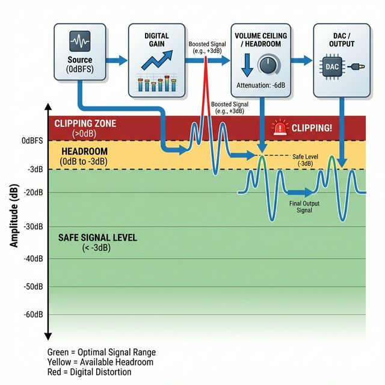

# Gain Staging & Headroom



## What is Gain Staging?

In digital audio, **Gain Staging** is the management of signal levels at each point in the audio pipeline to prevent distortion (clipping) while minimizing noise.

This driver implements automated gain staging within the Intel SST DSP pipeline to ensure high-fidelity playback, especially when using EQ or other effects.

## The Problem: Digital Clipping

Digital audio has a hard ceiling at **0 dBFS** (Decibels relative to Full Scale). Any signal that exceeds this limit is "clipped" — the peaks are chopped off, resulting in harsh, unpleasant distortion.

1.  **Source Material**: Most modern music is mastered very loudly, with peaks close to 0 dBFS.
2.  **Effects (EQ)**: If you apply a +3dB bass boost to a track peaking at 0dB, the new peak is +3dBFS.
3.  **Result**: Without headroom, the system clips.

## The Solution: Headroom Management

The `acpi_intel_sst` driver enforces a **Headroom Policy** to protect audio integrity.

### 1. Default Headroom (-3 dB)

By default, the driver maintains a **-3 dB safety margin**.

*   Even at "100%" volume in the mixer, the DSP output is scaled to -3 dBFS.
*   This prevents "inter-sample peaks" (ISPs) from clipping the DAC during digital-to-analog conversion.
*   It provides a small buffer for transient spikes.

### 2. Dynamic Budgeting for EQ

When you use the Parametric EQ (PEQ) to boost frequencies, the driver automatically adjusts the "Volume Ceiling" to maintain headroom.

**Example**:
*   You apply a **+6 dB** boost at 100Hz (`peq_gain=6`).
*   The driver automatically lowers the global volume ceiling by **6 dB**.
*   **Result**: The bass is boosted, but the overall signal stays safely below 0 dBFS. You effectively trade overall loudness for dynamic range and bass impact.

## Audiophile Details

### Signal Flow
```mermaid
graph LR
    A[PCM Source] -->|0dB| B[Volume Control]
    B -->|Headroom (-3dB)| C[Biquad Filter / EQ]
    C -->|Gain Compensation| D[Peak Limiter]
    D -->|Safety Limit| E[DAC / Output]
```

### Technical Specs
*   **Internal Resolution**: All DSP processing happens in **32-bit** (Q1.31 and Q2.30 fixed-point) precision. This offers massive dynamic range (over 180 dB), making internal clipping virtually impossible before the final output stage.
*   **Telemetery**: You can monitor real-time peak levels and clipping events via sysctl:
    *   `dev.acpi_intel_sst.0.telemetry.peak_db_left`
    *   `dev.acpi_intel_sst.0.telemetry.clip_count`

## Adjusting Headroom

While the automated system works best for most users, you can influence gain staging via the EQ gain parameter.

*   **Negative Gain (Cut)**: `peq_gain=-3` creates *more* headroom.
*   **Positive Gain (Boost)**: `peq_gain=+3` consumes headroom and lowers the overall volume ceiling.
