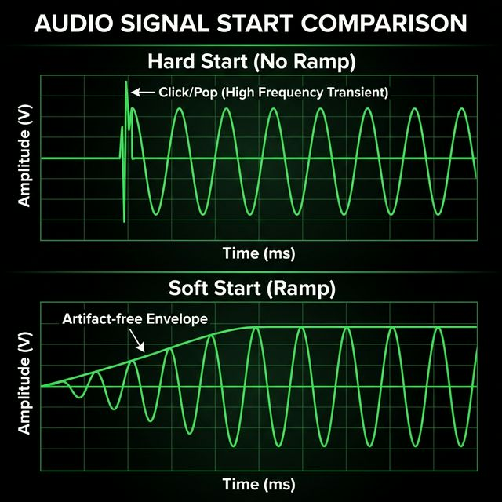
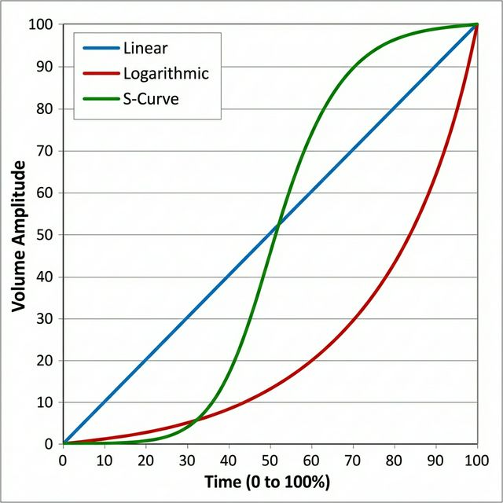

# Volume Ramping: Transient Response & Psychoacoustics

<div align="center">
  
</div>

## Abstract

In high-fidelity audio reproduction, signal integrity is paramount not just during steady-state playback, but also during state transitions. **Volume Ramping** (often called "Soft Start") is a critical DSP technique implemented in the `acpi_intel_sst` driver to eliminate the broadband noise artifacts—commonly heard as "pops" and "clicks"—that occur when audio hardware transitions from a low-power state to an active state.

This document details the technical implementation of volume ramping, the psychoacoustic principles behind our curve selection, and how to tune these parameters for your specific listening environment.

---

## 1. The Physics of Transients

When an audio stream is initialized, the entire hardware chain—from the DMA engine to the I2S interface, DAC, and analog amplifier—must wake up and synchronize.

### The DC Offset Problem
Analog amplifiers often suffer from "DC offset" during power-on. Even if the digital signal is absolute zero (silence), the physical act of energizing the circuit can send a voltage spike to the speakers.

Mathematically, this instant rise in voltage resembles a **Step Function**. In the frequency domain (via Fourier Transform), a perfect step function contains infinite frequency components. This is why a sudden start sounds like a sharp "click" or "pop"—it is literally a burst of broad-spectrum noise.

### The Digital Envelope Solution
To mitigate this, the `acpi_intel_sst` driver refuses to send raw PCM data to a newly woken DAC. Instead, it applies a **Digital Amplitude Envelope** to the signal.

By multiplying the source signal by a coefficient that rises from $0.0$ to $1.0$ over a fixed duration (e.g., $50ms$), we smooth out the step function. The sharp vertical edge becomes a gentle slope, shifting the energy from high-frequency transients to sub-audible low frequencies that are safely filtered out by the hardware.

---

## 2. Psychoacoustics: Linearity is not Linear

A naive implementation of volume ramping would increase the voltage linearly over time. However, the human ear is a logarithmic instrument. We perceive loudness according to the **Weber-Fechner law**—equal ratios of intensity result in equal differences in sensation.

<div align="center">
  
</div>

### Curve Topologies

The driver offers three distinct envelope shapes (`ramp_curve`), each with specific characteristics:

#### Type 0: Logarithmic (The "Audiophile" Curve)
*   **Characteristic:** Exponential voltage increase ($V \propto e^t$).
*   **Acoustic Result:** To the human ear, this sounds like a perfectly **linear** fade-in. The volume appears to rise at a constant rate from silence to unity gain.
*   **Why it's preferred:** It rushes through the low-voltage range (where the signal competes with the noise floor) and offers fine control in the audible range. This provides the most "transparent" experience, vanishing into the background.

#### Type 1: Linear (The "Diagnostic" Curve)
*   **Characteristic:** Constant voltage increase ($V \propto t$).
*   **Acoustic Result:** The sound appears to jump to ~80% volume almost instantly, then creep slowly to 100%.
*   **Use Case:** Debugging hardware gain linearity. generally undesirable for listening.

#### Type 2: S-Curve (The "Cinematic" Curve)
*   **Characteristic:** Sigmoid function ($V \propto \frac{1}{1+e^{-t}}$).
*   **Acoustic Result:** A "soft mechanical" feel. It starts very slowly, accelerates through the middle, and gently decelerates as it hits unity.
*   **Use Case:** Ideal for system notifications and UI sounds where a gentle, organic attack is desired.

---

## 3. DSP Implementation Details

The ramping mechanism operates in the `sst_pcm` driver layer, utilizing high-resolution kernel timers to feed the DSP.

*   **Precision:** 32-bit Fixed Point (Q1.31 format).
*   **Resolution:** 10ms update ticks.
*   **Mechanism:** IPC (Inter-Processor Communication).

At every tick of the ramp timer, the driver calculates the target gain coefficient and sends a `SET_VOLUME` command to the DSP firmware. The DSP then applies this gain to the mix *before* the I2S output stage. This ensures that even if the DAC downstream has non-linear/noisy power-up behavior, the digital signal feeding it remains strictly controlled.

```c
/* 
 * Logarithmic ramp lookup table (approximated)
 * 10 steps representing the decibel scale mapped to Q1.31 linear gain.
 */
static const int sst_ramp_log[] = {
     10,   /* -40 dB : Signal is effectively ensuring the DAC is "warm" */
     32,   /* -30 dB : Entering audible floor */
     80,   /* -22 dB : Low ambient level */
    ...
    1000,  /*   0 dB : Unity Gain (Bit-Perfect) */
};
```

---

## 4. Tuning Your Reference System

You can adjust the ramping parameters via `sysctl` to match your equipment's characteristics.

### For Solid State & Active Monitors (Default)
Most modern gear requires only brief stabilization.
*   `ramp_ms`: **50**
*   `resume_ramp_ms`: **50**
*   `ramp_curve`: **0 (Logarithmic)**

### For Tube Amplifiers & High-Voltage Gear
High-impedance equipment may take longer to stabilize DC offsets after sleep.
*   `ramp_ms`: **50**
*   `resume_ramp_ms`: **200 - 400** (Allow nearly half a second for wake-up)
*   `ramp_curve`: **0 (Logarithmic)**

### For Low-Latency / Bit-Perfect Purists
If you demand sample-accurate playback start (e.g., audio editing) and trust your hardware's muting relays:
*   `ramp_ms`: **0** (Disabled)
*   `resume_ramp_ms`: **0**

---

## Summary

Volume ramping is a subtle but essential feature of the `acpi_intel_sst` architecture. By respecting psychoacoustic principles and hardware physics, it ensures that your listening experience remains immersive and free of digital artifacts, protecting both your loudspeakers and your peace of mind.
