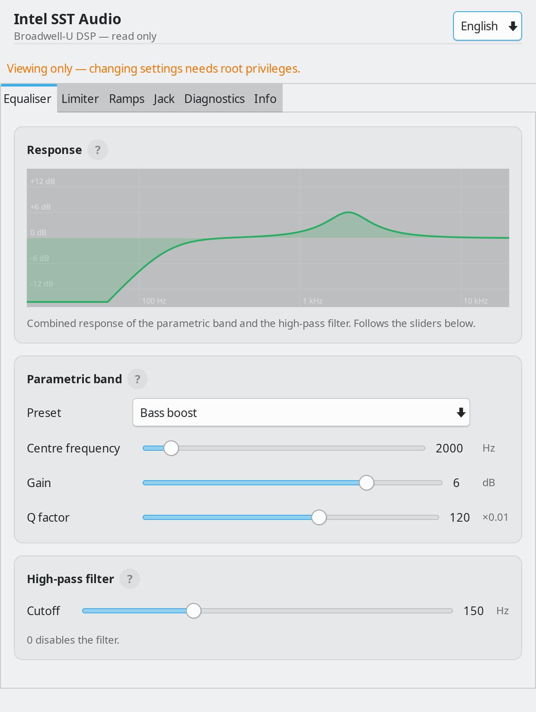
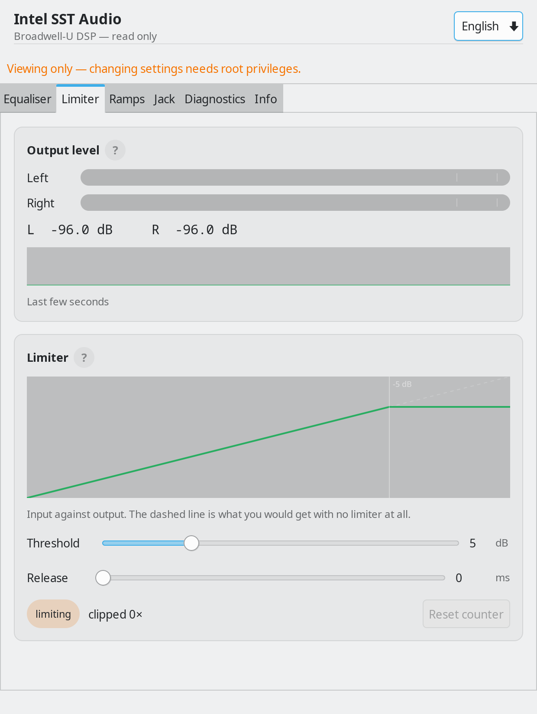
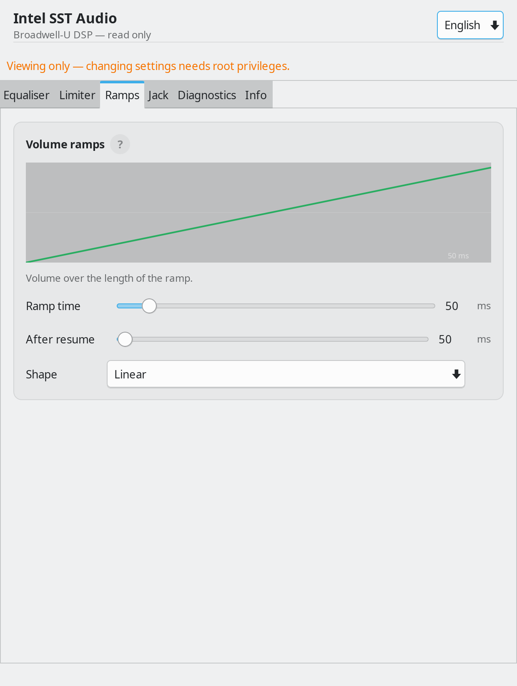
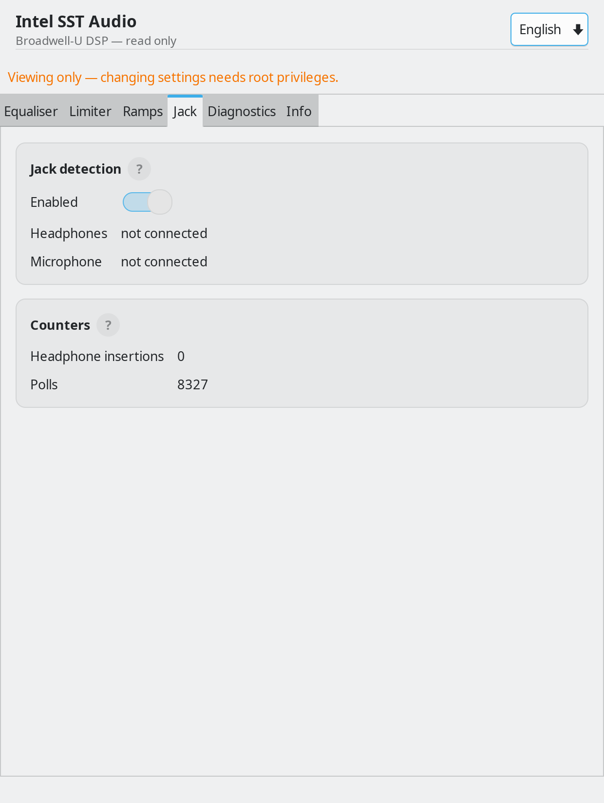
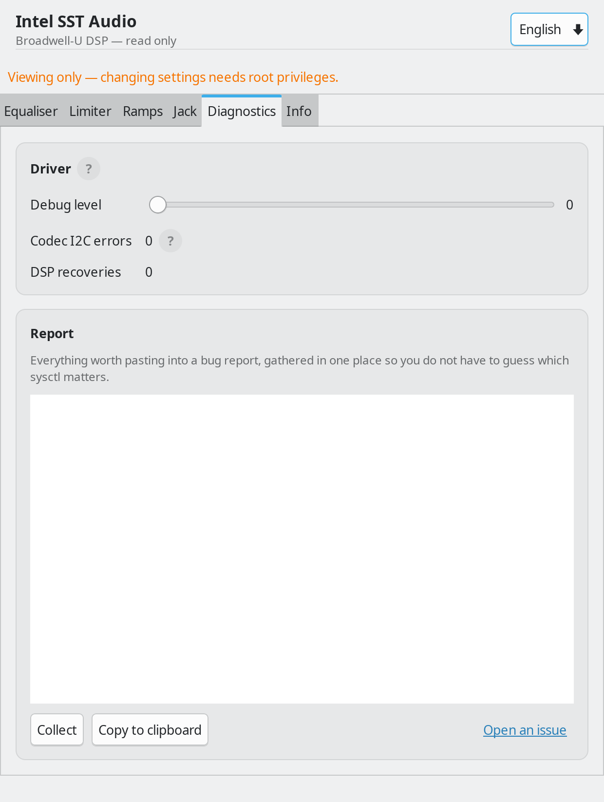
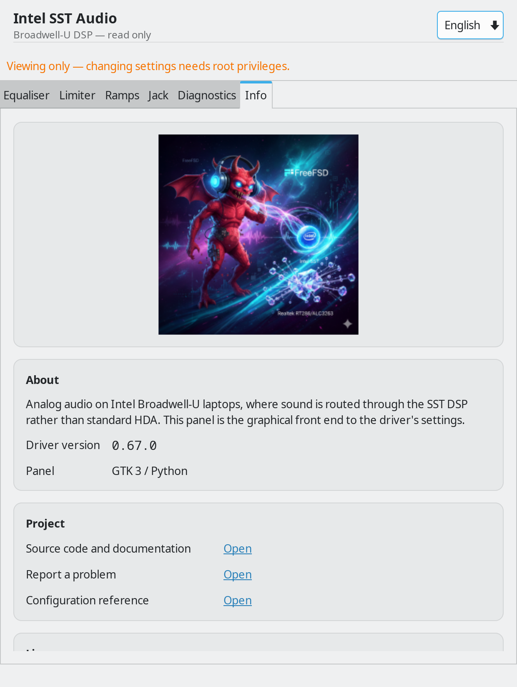

# sst-panel

A GTK3 control panel for the `acpi_intel_sst` driver.

## Screenshots

| | |
|---|---|
|  |  |
| Equaliser — live response curve | Limiter — meters, transfer curve |
|  |  |
| Ramps — shape over time | Jack — detection state |
|  |  |
| Diagnostics — report to paste into an issue | Info — version, links, licence |

Regenerate them with:

```sh
python3 sst_panel.py --lang en --screenshot ../docs/screenshots
```

The panel photographs its own window through GTK, so no screenshot tool needs
to be installed — there was none on the machine this was developed on.

## Why

The driver exposes 26 sysctls: a parametric equaliser, a limiter, volume
ramps, jack detection and live telemetry. They work perfectly well from the
command line, but tuning an equaliser by typing sysctl names is miserable, and
the peak meters only mean anything if you can watch them move.

## Running

```sh
sst-panel
```

Reading needs no privilege. **Changing** a setting does, because the sysctls
are root-writable only. The panel checks on startup and, when it cannot write,
says so in a banner and leaves the controls visible but disabled - an ordinary
user can still watch the telemetry, which is usually what you want when
diagnosing something.

To change settings, either run it as root:

```sh
sudo sst-panel
```

or allow the sysctl writes for a group. The narrow form, which permits exactly
this driver's tree and nothing else:

```
%wheel ALL=(root) NOPASSWD: /sbin/sysctl dev.acpi_intel_sst.0.*
```

## Plots

Three of the tabs draw what the settings actually do, updating as the sliders
move:

- **Equaliser** — the combined magnitude response of the parametric band and
  the high-pass filter, plotted against log frequency. An RBJ peaking biquad
  and a second-order Butterworth, evaluated at drawing resolution. These are
  pictures of the intent, not measurements of the DSP.
- **Limiter** — input against output, with the knee at the threshold and a
  dashed reference line showing the no-limiter case.
- **Ramps** — volume over the length of the ramp, in the selected shape.

The plots follow the *controls*, not the sysctls, so an unprivileged user can
still see what a setting would do before deciding it is worth becoming root
for.

The Limiter tab also carries live peak meters with peak-hold and a rolling
sparkline of the last few seconds — useful for telling whether the limiter is
catching occasional peaks or riding the signal continuously.

## Languages

The interface follows the user's locale and falls back to English, which is
also the language the source strings are written in — so an untranslated
string stays readable rather than turning into a msgid.

| code | language |
|---|---|
| `en` | English (source) |
| `pl` | Polski |
| `de` | Deutsch |
| `fr` | Français |
| `zh` | 中文 |

All 79 strings are translated in each. There is a selector in the header bar;
changing it asks for a restart, because GTK widgets are built with their
labels already in place.

**Chinese needs a CJK font installed** — `noto-sans-sc` or similar. Without
one the text renders as empty boxes, which looks like a bug in the panel and
is not.

To add a language: copy `po/pl.po` to the new code, translate the `msgstr`
lines, add the code to `LANGS` in the Makefile and to `LANGUAGES` in
`sst_i18n.py`.

## What is on each tab

| tab | contents |
|---|---|
| Korektor | preset, parametric band (frequency, gain, Q), high-pass cutoff |
| Limiter | threshold, release, live peak meters, clip counter |
| Rampy | volume ramp duration, resume ramp, ramp shape |
| Gniazdo | jack detection toggle and current state |
| Diagnostyka | driver debug level, codec I2C error count |

The telemetry refreshes four times a second. Everything else is read once at
startup and written when you move a control.

## Requirements

- `gtk3`
- `py311-pygobject` or newer (tested against py312-pygobject 3.54.5)
- the `acpi_intel_sst` driver loaded; the panel says so plainly if it is not

## Files

| file | role |
|---|---|
| `sst_sysctl.py` | access layer — reads and writes the sysctl tree |
| `sst_i18n.py` | locale detection and catalogue loading |
| `sst_meters.py` | peak meters and sparkline, drawn with Cairo |
| `sst_curves.py` | response plots for the equaliser, limiter and ramps |
| `sst_panel.py` | the interface |
| `sst-panel.desktop` | menu entry |
| `po/*.po` | translations |

## Building

```sh
make check     # compile the catalogues, byte-compile the sources
make install   # into /usr/local
make run       # from the checkout, without installing
```
